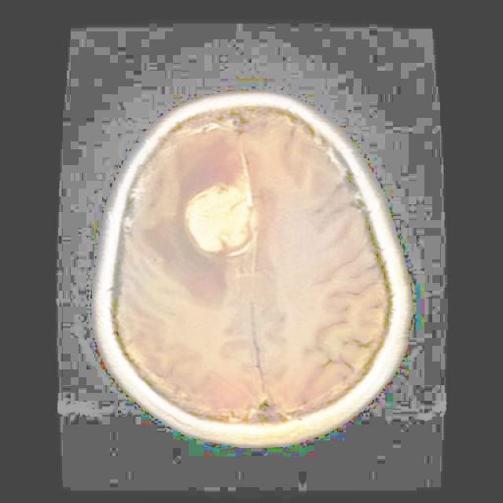
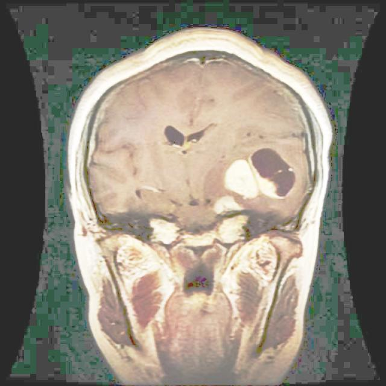
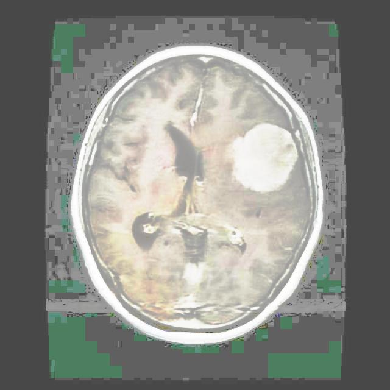
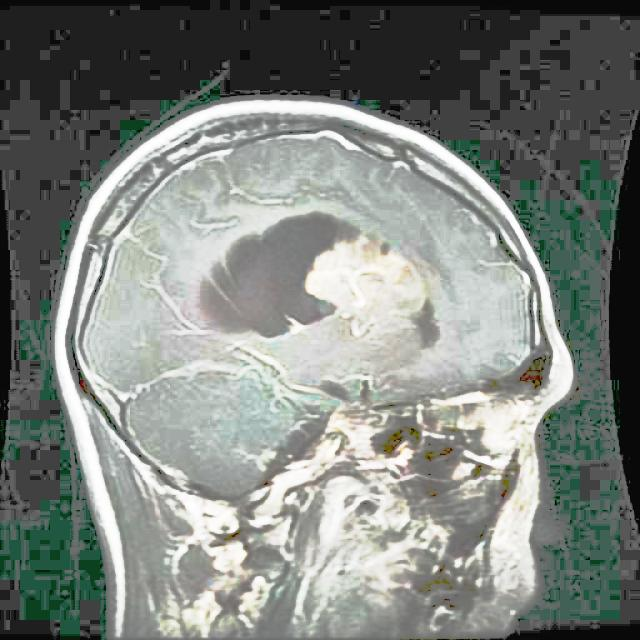

# OBJECT DETECTION BY YOLO11s.

## YOLO 11.

**1) Introduction**


YOLOv11 is the latest generation in the YOLO (You Only Look Once) family of real-time object detection 

models, developed by Ultralytics. It’s designed to detect and classify objects in images or video streams 

extremely fast while keeping high accuracy—making it ideal for things like surveillance, autonomous 

driving, robotics, and mobile apps.

**2) Here’s the quick idea:**


•	Single-pass detection: Like earlier YOLO versions, YOLOv11 looks at the whole image once and predicts bounding boxes + classes in one shot. 

•	Improved speed vs accuracy: It refines the architecture to be lighter and more efficient than YOLOv8, especially on GPUs and edge devices. 

•	Better training flexibility: Supports detection, segmentation, pose estimation, and classification in one framework. 

•	Edge-friendly: Runs well on smaller hardware (Jetson, mobile, etc.). 
In short: YOLOv11 = faster + more accurate + more versatile real-time object detection.

If you tell me what you're using it for (e.g., drones, CCTV, Python project), I can explain it in that context.


### 3) Questions:


# Qno1 How to run Yolo 11 on our local computer?


**Ans** To run YOLOv11 on your local computer, the easiest way is using Ultralytics’ Python package. Here’s the simplest step-by-step.


**1. Install Python (if not already)**

Use Python 3.9–3.12 (recommended)

Check:

python --version


**2. Create a virtual environment (recommended)**

python -m venv yolo11

*Activate:*

Windows

yolo11\Scripts\activate

Mac/Linux

source yolo11/bin/activate

**3. Install YOLOv11**

pip install ultralytics

This installs YOLOv11 automatically.

**4. Run YOLOv11 on an image**

from ultralytics import YOLO

model = YOLO("yolo11n.pt")  # nano model (fastest)

results = model("image.jpg", show=True)

That’s it — it will open a window with detected objects.

**5. Run from command line (even easier)**

yolo detect predict model=yolo11n.pt source=image.jpg

**6. Use webcam (real-time detection)**

from ultralytics import YOLO

model = YOLO("yolo11n.pt")

model.predict(source=0, show=True)

0 = webcam

Model sizes

You can choose:

•	yolo11n.pt — fastest (low accuracy) 

•	yolo11s.pt — small 

•	yolo11m.pt — medium 

•	yolo11l.pt — large 

•	yolo11x.pt — best accuracy (slowest) 

GPU (optional but faster)

If you have NVIDIA GPU:

pip install torch torchvision --index-url https://download.pytorch.org/whl/cu121

YOLO will automatically use GPU.


# Qno2 What can we do with the help of YOLO 11?


**Ans** With the help of YOLO 11, we can do object detection, image segmentation, pose estimation, and image classification. We can perform all these tasks with YOLO 11.


# Qno3 How to setup environment on local pcs or laptops?


**Ans** Setting up a Python virtual environment on your local computer is a good habit — it keeps projects like YOLOv11 separate and avoids dependency conflicts. Here’s the simplest way.

**Step 1 — Install Python**

Download and install Python from Python official site.

During install, check "Add Python to PATH".

Check installation:

python –version

**Step 2 — Create a virtual environment**

Open terminal / CMD in your project folder:

python -m venv myenv

This creates a folder named myenv.

**Step 3 — Activate the environment**

Windows (CMD / PowerShell)

myenv\Scripts\activate

Mac / Linux

source myenv/bin/activate

When activated, you’ll see:

(myenv) C:\your\folder>

That means the environment is active.

**Step 4 — Install packages inside env**

Example:

pip install ultralytics

This installs packages only inside this environment.


# Qno4 How to run yolo v11 on computers locally and pretrained models?


**Ans** Running YOLOv11 locally is pretty straightforward once you know the pieces: install Python + 

Ultralytics, download a pretrained model, then run inference on images/video. Here’s the clean, working path.

**1. What “YOLOv11 locally” means**

You run object detection on your own PC using pretrained weights like:

•	yolo11n.pt (fastest, smallest) 

•	yolo11s.pt 

•	yolo11m.pt 

•	yolo11l.pt 

•	yolo11x.pt (most accurate, heavy) 

These come from the Ultralytics YOLO package.

**2. Run YOLOv11 with pretrained model (image)**

yolo predict model=yolo11n.pt source=img.jpg

It will:

•	auto download pretrained model 

•	detect objects 

•	save output in runs/detect/predict 

**3. Python code version**

from ultralytics import YOLO

**load pretrained model**

model = YOLO("yolo11n.pt")

**run inference**

results = model("image.jpg", show=True)

**save results**

results[0].save("output.jpg")

**4. Run on webcam**

yolo predict model=yolo11n.pt source=0

or Python:

from ultralytics import YOLO

model = YOLO("yolo11n.pt")

model.predict(source=0, show=True)

**5. Run on video**

yolo predict model=yolo11n.pt source=video.mp4

**6. Run on folder of images**

yolo predict model=yolo11n.pt source=images/

**7. Available pretrained models**

Common ones:

yolo11n.pt   (nano - fastest)

yolo11s.pt   (small)

yolo11m.pt   (medium)

yolo11l.pt   (large)

yolo11x.pt   (extra large - best accuracy)

They automatically download first time you run them.

**8. GPU acceleration (important)**

If you have NVIDIA GPU:

Install CUDA PyTorch:

pip install torch torchvision torchaudio --index-url https://download.pytorch.org/whl/cu121

Then run:

model = YOLO("yolo11n.pt")

model.to("cuda")

**9. Where pretrained models come from**

They’re trained on:

•	COCO dataset (80 classes) 

•	People, cars, phones, animals, etc. 

*Example detections:*

•	person 

•	car 

•	truck 

•	dog 

•	phone 

•	laptop 

**10. Check YOLOv11 is working**

Run:

yolo

You should see CLI help.

**11. Folder structure after running**

project/
image.jpgruns/detect/predict/image.jpg

               
# Qno5 What is the image classification?


**Ans** Image classification means:

The model looks at the whole image and predicts one label for it.

Example:
•	input → picture of a cat 

•	output → "cat" 

No boxes, no locations — just what is in the image.

Compared to others (very important)

**1. Image Classification**

•	One label for entire image 

•	Example: "dog" 

•	No bounding box 

**2. Object Detection (what you're using with YOLO)**

•	Finds multiple objects 

•	Draws bounding boxes 

•	Example: "person", "car", "dog" with rectangles 

**3. Segmentation**

•	Pixel-level detection 

•	Colors exact shape of object 

Simple visual idea

Image classification:

[ image of street ]

Prediction: "street"

Object detection:

[ person ] [ car ] [ dog ]

   box        box     box

Your code using YOLOv8 = Object Detection, not classification.

If you want classification, code looks like:

from ultralytics import YOLO

import cv2

model = YOLO("yolov8n-cls.pt")   # classification model

img = cv2.imread("image.jpg")

results = model(img)

print(results[0].probs.top1)

print(results[0].names[results[0].probs.top1])

This prints only one class.

So:

•	YOLO detect boxes → Object Detection 

•	YOLO cls model → Image Classification


# Qno6 What is the computer vision?


**Ans** Computer Vision is a field of Artificial Intelligence that teaches computers to see, understand, and interpret images or videos the way humans do.

In simple words:

It’s how a machine “looks at pictures or videos and understands what’s inside them.”

What it allows computers to do

  Computer vision can help a system:

•	recognize objects (car, person, dog) 

•	detect faces (face unlock on phones) 

•	read text in images (OCR like scanning documents) 

•	track movement in videos (security cameras) 

•	understand scenes (road, sky, buildings) 

Simple example

If you show an image:

A photo of a street with cars and people

A computer vision model might output:

•	Person → detected 

•	Car → detected 

•	Traffic light → detected 

How it works (basic idea)

**1**	Input: image or video 

**2**	Processing: AI model analyzes patterns (edges, shapes, colors) 

**3**	Output: labels, boxes, or decisions 

Real-world uses

•	 Face unlock in smartphones 

•	 Self-driving cars 

•	 Medical X-ray detection 

•	 Amazon Go cashier-less stores 

•	YOLO object detection (what you're using) 


# Qno7 What what we can do in the field in computer vision?


**Ans** Computer Vision is a field of Artificial Intelligence that teaches computers to see, understand, and interpret images or videos the way humans do.

In simple words:

 It’s how a machine “looks at pictures or videos and understands what’s inside them.”
 
 What it allows computers to do

Computer vision can help a system:

•	recognize objects (car, person, dog) 

•	detect faces (face unlock on phones) 

•	read text in images (OCR like scanning documents) 

•	track movement in videos (security cameras) 

•	understand scenes (road, sky, buildings) 

Simple example

If you show an image:

A photo of a street with cars and people

A computer vision model might output:

•	Person → detected 

•	Car → detected 

•	Traffic light → detected 

 How it works (basic idea)

**1**	Input: image or video 

**2**	Processing: AI model analyzes patterns (edges, shapes, colors) 

**3**	Output: labels, boxes, or decisions 
 
 Real-world uses

•	 Face unlock in smartphones 

•	 Self-driving cars 

•	 Medical X-ray detection 

•	 Amazon Go cashier-less stores 

•	 YOLO object detection (what you're using) 

**1** Software Development (Apps & Websites)

You build things people use every day.

•	Websites (like YouTube, Amazon) 

•	Mobile apps (Android / iOS) 

•	Desktop software 

 Example:

•	WhatsApp, Instagram, banking apps 

Skills:

•	Python / JavaScript / Java 

**2** Artificial Intelligence (AI)

You make computers “think smart”.

•	Chatbots (like ChatGPT) 

•	Image recognition (YOLO, face detection) 

•	Recommendation systems (Netflix, YouTube) 

 Example:

•	Your YOLO object detection project is AI 

Skills:

•	Python, Machine Learning, Deep Learning 

**3** Computer Vision

You make computers see and understand images/videos

•	Object detection (YOLO) 

•	Face recognition 

•	Self-driving cars 

•	Medical imaging 

 Example:

•	CCTV detecting people 

•	Car detecting pedestrians 

 **4** Data Science

You work with data to find patterns and predictions.

•	Business analytics 

•	Stock prediction 

•	Customer behavior 

 Example:

•	Netflix recommending movies 

Skills:
•	Python, Pandas, Statistics 

**5** Networking & Cybersecurity

You protect computers and data.

•	Hacking protection 

•	Cyber attacks prevention 

•	Network security 

 Example:

•	Banks protecting accounts from hackers 

**6** Game Development

You build games.

•	PC games 

•	Mobile games 

•	3D simulations 

 Example:

•	PUBG, GTA, Free Fire 

**7** Hardware / Robotics

You work with physical machines.

•	Robots 

•	IoT devices 

•	Automation systems 

 Example:

•	Smart home systems 

•	Factory robots 

 Simple summary

Computer field = many paths:

•	 Build apps → Software Dev 

•	 Make AI → Machine Learning 

•	 Make machines see → Computer Vision 

•	 Work with data → Data Science 

•	 Secure systems → Cybersecurity 

•	 Build games → Game Dev


# Qno8 If you want to create your own custom object detection model, how do you prepare its dataset?


**Ans** To create your custom object detection model, dataset preparation has 4 main steps:


**1** Collect Images

You need images containing the objects you want to detect.

Example:

•	cars 

•	helmets 

•	people 

•	animals 

Dataset example:

images/

   img1.jpg
   
   img2.jpg
   
   img3.jpg

Rules:

•	different angles 

•	different lighting 

•	different sizes 

•	different backgrounds 

More variety = better model

**2** Annotate (Draw Bounding Boxes)

You must draw boxes around objects and assign labels.

Example:

[ person ]  ← box

[ helmet ]  ← box

Tools for annotation:

•	LabelImg 

•	CVAT 

•	Roboflow 

This creates label files like:

img1.txt

img2.txt

YOLO label format:

class x_center y_center width height

Example:

0 0.52 0.41 0.33 0.44

3. Folder Structure (YOLO format)

dataset/images/train/val/labels/train/val/

Example:

images/train/img1.jpg

labels/train/img1.txt

Names must match.

**4** Create data.yaml

path: dataset

train: images/train

val: images/val

names:

  0: person
  
  1: helmet
  
  2: car

Minimum Dataset Size

•	small test → 50 images 

•	okay model → 200 images 

•	good model → 500+ images 

•	strong model → 2000+ images 

Final Training Command

yolo detect train data=data.yaml model=yolov8n.pt epochs=50

Full Pipeline

**1**	Collect images 

**2**	Draw bounding boxes 

**3**	Save YOLO labels 

**4**	Split train / val 

**5**	Create data.yaml 

**6**	Train model


# Qno9 How to use costume dataset for training a model?


**Ans** Here is the correct minimal workflow to train a model using your custom dataset with YOLOv8.

**1** Dataset Structure (REQUIRED)

dataset/images/train/img1.jpg

img2.jpg/val/

img3.jpg

img4.jpg/labels/train/
    
img1.txt
    
img2.txt/val/
    
img3.txt
        
img4.txt

Image name and label name must be same

img1.jpg → img1.txt

**2** Create data.yaml

path: dataset

train: images/train

val: images/val

names:

  0: person
  
  1: helmet
  
  2: car

**3** Train Model (Python)

from ultralytics import YOLO

model = YOLO("yolov8n.pt")

model.train(
    data="data.yaml",
    epochs=50,
    imgsz=640,
    batch=8
)

**4** Or Train Using Command Line

yolo detect train data=data.yaml model=yolov8n.pt epochs=50 imgsz=640

**5** Output Model Location

After training:

runs/detect/train/weights/best.pt

Use it like:

from ultralytics import YOLO

model = YOLO("runs/detect/train/weights/best.pt")

**6** Label Format (YOLO)

Each .txt file:

class x_center y_center width height

Example:

0 0.52 0.44 0.31 0.28

That's it.

This is the complete correct way to train using custom dataset.


# Qno10 How to perform object detection?


**Ans** To perform object detection using YOLO, you just need 3 steps:

**1** Load Model

from ultralytics import YOLO

model = YOLO("yolov8n.pt")

**2** Run Detection (image / video / webcam)

Image

import cv2

from ultralytics import YOLO

model = YOLO("yolov8n.pt")

img = cv2.imread("image.jpg")

results = model(img)

print(results)

Video (Object Detection)

from ultralytics import YOLO

import cv2

model = YOLO("yolov8n.pt")

cap = cv2.VideoCapture("video.mp4")

while True:
    ret, frame = cap.read()
    if not ret:
        break

   results = model(frame)

   annotated = results[0].plot()

   cv2.imshow("Detection", annotated)

   if cv2.waitKey(1) & 0xFF == 27:
        break

cap.release()

cv2.destroyAllWindows()

**3** Access Detection Data (boxes, class, confidence)

for r in results:

  for box in r.boxes:
    
  cls = int(box.cls[0])
        
  conf = float(box.conf[0])
        
  print(cls, conf)

What Object Detection Gives You

For each object:

•	Class name (person, car, dog) 

•	Confidence score 

•	Bounding box coordinates 

Example output:

person 0.92

car 0.88

dog 0.76

Use Your Custom Model

model = YOLO("best.pt")

Everything else stays same.

So object detection pipeline:

**1**	Load model 

**2**	Pass image/frame 

**3**	Get boxes + labels 

**4**	Draw or use result


# Qno11 How to perform custom dataset for training object detection?


**Ans** To prepare a custom dataset for object detection, follow these exact steps.

**1** Collect Images

Collect images that contain your objects.

Example:

•	helmets 

•	cars 

•	persons 

Put them in a folder:

images/
   img1.jpg
   img2.jpg
   img3.jpg

Use:

•	different angles 

•	different lighting 

•	different backgrounds 

•	different object sizes 

**2** Annotate Images (Draw Bounding Boxes)

You must draw bounding boxes around objects and assign labels.

Use tools like:

•	LabelImg 

•	CVAT 

•	Roboflow 

Example annotation:

[ person ] 

[ helmet ]

This creates label files:

img1.txt

img2.txt

**3** YOLO Label Format

Each .txt file contains:

class x_center y_center width height

Example:

0 0.50 0.42 0.30 0.28

1 0.32 0.61 0.20 0.25

Numbers are normalized (0–1).

**4** Dataset Folder Structure (IMPORTANT)

dataset/images/train/val/labels/train/val/

Example:

dataset/

images/train/img1.jpg
 
labels/train/img1.txt

Image and label names must match.

**5** Create data.yaml

path: dataset

train: images/train

val: images/val

names:

  0: person
  
  1: helmet
  
  2: car

**6** Train Model

from ultralytics import YOLO

model = YOLO("yolov8n.pt")

model.train(
    data="data.yaml",
    epochs=50,
    imgsz=640
)

Full Pipeline

**1**	Collect images 

**2**	Annotate bounding boxes 

**3**	Save YOLO labels 

**4**	Split train / val 

**5**	Create data.yaml 

**6**	Train model 

That's the complete custom object detection dataset preparation workflow.


# Qno12 How to train object detection model?


**Ans** To train an object detection model (YOLOv8), use this exact process.

**1** Dataset Structure

dataset/images/train/val/labels/train/val.

Example:

images/train/img1.jpg

labels/train/img1.txt

**2** Create data.yaml

path: dataset

train: images/train

val: images/val

names:
  0: person
  1: helmet
  2: car

**3** Train Model (Python)

from ultralytics import YOLO

model = YOLO("yolov8n.pt")

model.train(

  data="data.yaml",
    
  epochs=50,
  
  imgsz=640,
  
  batch=8)

**4** Train (Command Line)

yolo detect train data=data.yaml model=yolov8n.pt epochs=50 imgsz=640

**5** Training Output

After training finishes:

runs/detect/train/weights/best.pt

This is your trained object detection model.

**6** Use Trained Model

from ultralytics import YOLO

import cv2

model = YOLO("runs/detect/train/weights/best.pt")

img = cv2.imread("test.jpg")

results = model(img)

cv2.imshow("result", results[0].plot())

cv2.waitKey(0)

Training Flow

**1**	Prepare dataset 

**2**	Create data.yaml 

**3**	Load YOLO model 

**4**	Run .train() 

**5**	Get best.pt 

**6**	Use your model


# Qno13 how to perform inference using trained model?


**Ans** To perform inference using your trained YOLO model (best.pt), just load the model and pass an image/video.

**1** Inference on Image

from ultralytics import YOLO

import cv2

model = YOLO("runs/detect/train/weights/best.pt")

img = cv2.imread("test.jpg")

results = model(img)

annotated = results[0].plot()

cv2.imshow("Result", annotated)

cv2.waitKey(0)

cv2.destroyAllWindows()

**2** Inference on Video

from ultralytics import YOLO

import cv2

model = YOLO("runs/detect/train/weights/best.pt")

cap = cv2.VideoCapture("video.mp4")

while True:

ret, frame = cap.read()
    
if not ret:
    
   break

results = model(frame)
    
annotated = results[0].plot()
    
cv2.imshow("Detection", annotated)
    
   if cv2.waitKey(1) & 0xFF == 27:
        break

cap.release()

cv2.destroyAllWindows()

**3** Inference using Webcam

from ultralytics import YOLO

import cv2

model = YOLO("best.pt")

cap = cv2.VideoCapture(0)

while True:

ret, frame = cap.read()
    
if not ret:
    
  break

results = model(frame)
    
annotated = results[0].plot()
    
cv2.imshow("Webcam", annotated)
    
if cv2.waitKey(1) & 0xFF == 27:
    
   break

cap.release()

cv2.destroyAllWindows()

**4** Get Detection Values

for r in results:

for box in r.boxes:
    
cls = int(box.cls[0])
        
conf = float(box.conf[0])
        
print(cls, conf)

That’s it:

**1**	Load best.pt 

**2**	Pass image/frame 

**3**	Show results[0].plot()


# Qon14 What kind of dataset is required for object detection?


**Ans** For object detection, you need a dataset with images + bounding box labels.

That’s the key requirement.

Required Dataset for Object Detection

Each image must have:

•	the object class name 

•	bounding box around object 

•	coordinates of box 

Example:

Image:

image1.jpg

Label:

image1.txt

Label content (YOLO format):

0 0.52 0.41 0.30 0.44

1 0.33 0.65 0.20 0.25

This means:

•	class 0 → person 


•	class 1 → helmet 

•	numbers → bounding box location 

Dataset Structure

dataset/images/train/val/labels/train/val

Example:

images/train/img1.jpg

labels/train/img1.txt

Names must match.

Types of Objects You Can Train

Your dataset can contain:

•	People detection 

•	Car detection 

•	Helmet detection 

•	Animal detection 

•	Weapon detection 

•	Custom objects (anything) 

Object detection works for any object if labeled properly.

Dataset Requirements

Your dataset should have:

•	multiple images 

•	different backgrounds 

•	different lighting 

•	different angles 

•	multiple object sizes 

•	multiple objects per image (optional) 

Minimum Dataset Size

•	Testing → 50 images 

•	Small model → 200 images 

•	Good model → 500+ images 

•	Strong model → 2000+ images 

Example Object Detection Dataset

Image:

•	2 persons 

•	1 car 

Label file:

person box

person box

car box

Each object → one bounding box.

So the required dataset type is:

Images + bounding boxes + class labels


# Qno15 How many types of model detection in yolo program?


**Ans** There are the many types of model detection in yolo program.

Here are popular object detection model names. These are widely used in computer vision.

Two-Stage Object Detection Models

(accurate but slower)

•	R-CNN 

•	Fast R-CNN 

•	Faster R-CNN 

•	Mask R-CNN 

•	Cascade R-CNN 

One-Stage Object Detection Models

(fast and real-time)

•	YOLO 

•	SSD 

•	RetinaNet 

•	EfficientDet 

•	CenterNet 

Modern / Newer Models

•	DETR 

•	Deformable DETR 

•	DINO 

•	RT-DETR 

Most commonly used in practice

   Top ones you’ll see most:

•	YOLO 

•	Faster R-CNN 

•	SSD 

•	RetinaNet 

•	EfficientDet 

•	DETR


# Qno16 If we want to detect multiple objects classvise  track them, and count them, how will we do it?


**Ans** Detect, Track, and Count Multiple Objects Class-wise

To detect multiple objects, track them, and count them class-wise, we follow a step-by-step approach:

**1** Object Detection

First, we use an object detection model like YOLO to detect different classes of objects (such as cars, people, bikes) in each frame of a video.

The model gives:

•	Bounding boxes 

•	Class labels 

•	Confidence scores 

**2** Object Tracking

Next, we apply a tracking algorithm like DeepSORT.

This assigns a unique ID to each detected object and keeps track of it across frames.

This step helps us:

•	Know which object is which 

•	Avoid counting the same object multiple times 

**3** Class-wise Separation

Each detected object already has a class label (e.g., person, car).

We group objects based on their class so we can count them separately.

**4** Counting Mechanism

To count objects, we define a rule such as:

•	A virtual line or region in the frame 

•	When an object crosses the line, it is counted 

For each object ID:

•	If it crosses the line once → increase count 

•	Maintain separate counters for each class 

Example:

•	Cars count = 10 

•	People count = 5 

**5** Final Output

The system shows:

•	Tracked objects with IDs 

•	Class labels 

•	Total count of each class 

Conclusion (Short Form)

We use YOLO for detection, DeepSORT for tracking, and a line-crossing method to count objects separately for each class.

Simple Flow

Detection → Tracking → Assign IDs → Class grouping → Counting


# Qno17 What is the bot sort algoruithm?


**Ans** BoT-SORT is a multi-object tracking algorithm.

It is used after object detection to track objects across video frames.

So:

•	YOLO → detects objects 

•	BoT-SORT → tracks them (keeps same ID) 

What BoT-SORT does

Example video:

Frame 1:

Person → ID 1

Car    → ID 2

Frame 2:

Person → ID 1  (same person tracked)

Car    → ID 2  (same car tracked)

It keeps consistent IDs for moving objects.

What "BoT-SORT" means

BoT-SORT = Bag of Tricks SORT

It is an improved version of:

•	SORT 

•	Deep SORT 

BoT-SORT improves both.

How BoT-SORT works (simple)

It combines:

•	object detection (YOLO boxes) 

•	motion prediction (Kalman filter) 

•	appearance matching (ReID features) 

•	IOU matching 

Then assigns IDs.

When you use BoT-SORT

Use it when you need:

•	people counting 

•	vehicle tracking 

•	CCTV tracking 

•	multi-object tracking 

•	line crossing detection 

YOLO + BoT-SORT Example

from ultralytics import YOLO

model = YOLO("yolov8n.pt")

results = model.track(

   source="video.mp4",
    
   tracker="botsort.yaml",
    
   show=True
   
)

This will:

•	detect objects 

•	assign IDs 

•	track across frames 

Output example

Person ID:1

Person ID:2

Car ID:3

IDs stay same while moving.

So in one line:

BoT-SORT = algorithm used to track detected objects in video


# Qno18 What is the object tracking?


**Ans** Object tracking means:

Following a detected object across multiple frames in a video and keeping its identity (ID).

Simple idea

Imagine a video:

Frame 1:

•	Person → ID 1 

Frame 2:

•	Same person moves → still ID 1 

Frame 3:

•	Still same person → ID 1 

This is tracking — not just detecting, but remembering the object.

Difference from Object Detection

•	Object Detection → finds objects in a single frame 

•	Object Tracking → follows those objects over time 

Example:

Detection:

Frame 1 → person, car

Frame 2 → person, car

Tracking:

Frame 1 → person(ID 1), car(ID 2)

Frame 2 → person(ID 1), car(ID 2)

How it works (simple)

Tracking systems use:

•	object detection (like YOLO) 

•	motion prediction 

•	matching objects between frames 

Common tracking algorithms:

•	SORT 

•	Deep SORT 

•	BoT-SORT 

Real-world uses

•	CCTV surveillance 

•	counting people or vehicles 

•	sports analytics 

•	self-driving cars 

•	face tracking 

Example (YOLO + Tracking)

from ultralytics import YOLO

model = YOLO("yolov8n.pt")

results = model.track(

   source="video.mp4",
    
   tracker="botsort.yaml",
    
   show=True
)

Final definition

tracking = detecting objects and keeping their identity across frames in a video

# Qno19 How to perform object tracking?

**Ans** Object tracking is a really fun and practical area of computer vision—it’s what lets systems 
follow a moving person, car, ball, or any object across video frames. The “how” depends a bit on your goal (accuracy vs. speed vs. simplicity), but here’s a clear way to approach it.

**1. Understand the pipeline**

At its core, object tracking usually follows this loop:

**1**	Detect the object (in the first frame or every frame) 

**2**	Assign an ID to the object 

**3**	Track its movement across subsequent frames 

**4**	Update its position as it moves 

**2. Choose your approach**

  **A. Traditional Tracking (fast, simpler)**

   These don’t require heavy AI models:

•	KCF (Kernelized Correlation Filter) 

•	CSRT (more accurate, slower) 

•	MOSSE (very fast, less accurate) 

You can use them directly with OpenCV.

Example (Python + OpenCV):

import cv2

tracker = cv2.TrackerCSRT_create()

video = cv2.VideoCapture("video.mp4")

ret, frame = video.read()

bbox = cv2.selectROI(frame, False)

tracker.init(frame, bbox)

while True:
    ret, frame = video.read()
    if not ret:
        break

   `success, bbox = tracker.update(frame)`
   
  if success:
     x, y, w, h = [int(v) for v in bbox]
     cv2.rectangle(frame, (x,y), (x+w,y+h), (0,255,0), 2)
     cv2.imshow("Tracking", frame)
    if cv2.waitKey(1) & 0xFF == 27:
        break

**B. Deep Learning-Based Tracking (more powerful)**

These combine detection + tracking:

•	YOLO (for detection) + SORT/DeepSORT (for tracking) 

•	Siamese networks (like SiamMask, SiamRPN) 

Workflow:

•	Detect objects using YOLO 

•	Pass detections to a tracker like DeepSORT 

•	Maintain consistent IDs across frames 

**3** Single vs Multi-object tracking

•	Single object tracking → easier (OpenCV trackers) 

•	Multi-object tracking (MOT) → needs: 

o	Detection every frame 

o	ID assignment (tracking-by-detection) 

**4** Key challenges to handle

•	Occlusion (object gets hidden) 

•	Lighting changes 

•	Fast motion / motion blur 

•	Similar-looking objects 

Deep learning trackers handle these better than classical ones.

**5** Tools & libraries

•	OpenCV → easiest starting point 

•	PyTorch / TensorFlow → for deep learning models 

•	Pretrained YOLO models → quick setup 

**6** What should you start with?

•	If you're a beginner → start with OpenCV CSRT tracker 

•	If you want real-world accuracy → YOLO + DeepSORT 

•	If you're building research-level systems → Siamese trackers 


# Qno20 How much there we have object tracking algorithms?


**Ans** There is no fixed number of object tracking algorithms. In fact, there are many (dozens) of algorithms, and new ones are still being developed.

We usually group them into categories instead of counting them.

**1. Traditional (Classical) Tracking Algorithms**

These are simpler and faster, often used with OpenCV:

•	KCF (Kernelized Correlation Filter) 

•	CSRT (more accurate) 

•	MOSSE (very fast) 

•	MedianFlow 

•	TLD (Tracking-Learning-Detection) 

•	Boosting Tracker 

•	MIL (Multiple Instance Learning) 

Around 6–10 common classical trackers

**2. Deep Learning-Based Tracking Algorithms**

These are modern and more powerful:

•	Using detection + tracking: 

o	YOLO + SORT 

o	YOLO + DeepSORT 

•	Siamese-based trackers: 

o	SiamFC 

o	SiamRPN 

o	SiamMask 

Around 10–20+ popular deep learning trackers

**3. Multi-Object Tracking (MOT) Algorithms**

Used when tracking multiple objects:

•	SORT 

•	DeepSORT 

•	ByteTrack 

•	FairMOT 

Around 5–10 well-known methods

Final Answer (simple form)

There is no exact number of object tracking algorithms, but there are more than 20–30 commonly used 

algorithms, and they are mainly divided into classical methods and deep learning-based methods.


# Qno21 when to use wich tracking algorithm?


**Ans** We don’t pick a tracker randomly. The choice depends on speed, accuracy, number of objects, and environment.

**1. Use Classical Trackers (Simple & Fast)**

(using OpenCV)

Use when:

•	You are tracking only one object 

•	You need real-time performance 

•	System is low-power (basic PC, embedded system) 

Which one to choose:

•	MOSSE → when you need very high speed 

•	KCF → when you want balance of speed + accuracy 

•	CSRT → when you need high accuracy (slower) 

**2. Use Detection + Tracking (Modern Approach)**

(using YOLO + trackers like SORT/DeepSORT)

Use when:

•	You have multiple objects 

•	Objects may enter/leave the scene 

•	You need object IDs (who is who) 

Which one to choose:

•	YOLO + SORT → faster, but less accurate 

•	YOLO + DeepSORT → more accurate, keeps identity better 

**3. Use Deep Learning Trackers (Advanced Cases)**

Use when:

•	Objects are moving fast 

•	There is occlusion (objects get hidden) 

•	Environment is complex (crowds, lighting changes) 

Examples:

•	SiamRPN 

•	SiamMask


# Qno22 How to perform instance segmentation on custom data set?


**Ans** Instance segmentation is a technique used to detect objects in an image and also identify the exact pixels belonging to each object.

To perform instance segmentation on a custom dataset, the following steps are used:

**1. Collect the Dataset**

First, we collect images related to our problem (for example, cars, people, fruits, etc.). The dataset should have enough variation in lighting, angles, and backgrounds.

**2. Annotate the Images**
 
Next, we label the objects in each image. In instance segmentation, we draw masks (pixel-wise labels) around each object instead of just bounding boxes.

Tools like LabelMe or CVAT are commonly used.

**4. Prepare the Dataset**

After annotation, we convert the data into a required format (such as COCO format). Then we split the dataset into:

•	Training set 

•	Validation set 

**5. Choose a Model**

We select an instance segmentation model such as:

•	Mask R-CNN (most common) 

•	YOLOv8 segmentation version 

**6. Train the Model**

We train the model using frameworks like:

•	PyTorch 

•	TensorFlow 

During training, the model learns:

•	Object detection 

•	Object classification 

•	Pixel-wise masks 

**7. Evaluate the Model**

After training, we test the model on validation data using metrics like accuracy or mAP (mean Average Precision).

**8. Perform Inference**

Finally, we use the trained model on new images. The model will:

•	Detect objects 

•	Draw bounding boxes 

•	Generate masks for each object 

Conclusion (Short Form)

Instance segmentation on a custom dataset involves collecting data, annotating masks, preparing the dataset, training a model like Mask R-CNN, and then using it to predict objects with pixel-level accuracy.


# HERE ARE THE SOME CODES WITH LITTLE THEORY ABOUT YOLO 11ns...


**THESE CODES ARE ONLY FOR BRAIN TUMOR DETECTING AND TRAINING YOUR MODELS...**


# NO1) JSON to YOLO Annotation Converter

**Overview**

This project provides a Python script to convert annotation data from JSON format (COCO-style) into YOLO format. This is useful when preparing custom datasets for training YOLO-based object detection models.

**Objective**

The main goal of this code is:

- Read multiple JSON annotation files

- Extract image and bounding box information

- Convert bounding boxes into YOLO format

- Save labels as `.txt` files

**Input**

The script takes:

- Multiple JSON files containing:

 - `images`

 - `annotations`

- Each annotation includes:

- Bounding box (`bbox`)

- Image ID

- Category ID

**Output**

- YOLO format `.txt` files

- Each file corresponds to one image

- Saved in the specified output folder

*How It Works (Theory)*

**Read JSON Files**

The script loads multiple JSON files one by one and checks if they exist.

**2. Validate Format**

It ensures the JSON file contains:

- `images`

- `annotations`

If not, it skips the file.

**3. Group Annotations**

Annotations are grouped by `image_id` so each image gets its corresponding bounding boxes.

**4. Extract Image Information**

For each image:

- File name

- Width and height

These are required to normalize bounding box values.

**5. Convert Bounding Boxes to YOLO Format**

COCO format:

[x, y, width, height]


YOLO format:

[class_id, x_center, y_center, width, height]

Conversion formulas:

x_center = (x + w/2) / image_width

y_center = (y + h/2) / image_height

w = w / image_width

h = h / image_height

**6. Class ID Adjustment**

- Category ID is converted to zero-based index:

class_id = category_id - 1

**7. Save Label Files**

- One `.txt` file per image

- Each line represents one object:


class_id x_center y_center width height

*Usage*

**1. Update JSON file paths:**

*code for example:*

json_files = ["path/to/file1.json", "path/to/file2.json"]

Set output directory:

output_path = "path/to/output/labels"

*Run the script:*

python script.py

*Example Output*

0 0.512345 0.423456 0.234567 0.345678

1 0.623456 0.512345 0.123456 0.234567

**Applications**

Preparing custom datasets for YOLO

Object detection training

Computer vision projects

**Notes**

Ensure JSON format follows COCO structure

Image width and height must be correct

Category IDs should start from 1


# CODE No 1


```PYTHON CODE
           [CREATE JSON FILE AND CONVERT INTO YOLO FILE]


 import json
 import os

 json_files = [
     r"A:\computer_Vision\Yolov8\data\mouse.json",
     r"A:\computer_Vision\Yolov8\data\train 2.json",
     r"A:\computer_Vision\Yolov8\data\train 3.json"
 ]

 output_path = r"A:\computer_Vision\Yolov8\data\labels"

 def convert_json_to_yolo(json_files, output_path):
     os.makedirs(output_path, exist_ok=True)

     for json_path in json_files:
         print("Checking:", json_path)

         if not os.path.isfile(json_path):
             print("NOT FOUND:", json_path)
             continue

         with open(json_path, 'r') as f:
             data = json.load(f)

         print("Keys:", data.keys())

         if 'images' not in data or 'annotations' not in data:
             print("WRONG FORMAT:", json_path)
             continue

         ann_by_image = {}
         for ann in data['annotations']:
             img_id = ann['image_id']
             ann_by_image.setdefault(img_id, []).append(ann)

         for img in data['images']:
             img_id = img['id']
             img_name = img['file_name']
             width = img.get('width', 1)
             height = img.get('height', 1)

             annotations = ann_by_image.get(img_id, [])
             if not annotations:
                 continue

             txt_name = os.path.splitext(img_name)[0] + '.txt'
             txt_path = os.path.join(output_path, txt_name)

             with open(txt_path, 'w') as out:
                 for ann in annotations:
                     if 'bbox' not in ann:
                         continue

                     x, y, w, h = ann['bbox']

                     x_center = (x + w / 2) / width
                     y_center = (y + h / 2) / height
                     w_norm = w / width
                     h_norm = h / height

                     class_id = int(ann.get('category_id', 0)) - 1

                     out.write(f"{class_id} {x_center:.6f} {y_center:.6f} {w_norm:.6f} {h_norm:.6f}\n")

             print("CREATED:", txt_path)

convert_json_to_yolo(json_files, output_path)
```


# THESE ARE THE THREE IMAGES WHICH ARE USED INTO THE CODE:

## IMAGE NO 1 




## IMAGE NO 2 


## IMAGE NO 3 


# NO2) YOLO Model Training (Custom Dataset)


**Overview**

This project demonstrates how to train a YOLO model on a custom dataset using the Ultralytics YOLO framework. The code loads a pre-trained model and fine-tunes it on user-defined data.

*Objective*

The main purpose of this code is:

- Load a pre-trained YOLO model

- Train it on a custom dataset

- Adjust parameters like epochs and image size

- Generate a trained model for object detection

*Technology Used*

- Python
 
- Ultralytics YOLO (YOLOv8/YOLO11)

**Theory**

**1. Load Pre-trained Model**

*The model is initialized using:*

***python for example***

model = YOLO("yolo11n.pt")

yolo11n.pt is a pre-trained model

It already has learned features from large datasets

This process is called transfer learning

**2. Training the Model**

train_results = model.train(

data="data.yaml",
   
epochs=20,
   
imgsz=120,
    
device="cpu"

)


**3. Parameters Explanation**


*data*

Path to data.yaml file

Contains:

Training and validation paths

Class names

Number of classes

*epochs*

Number of times the model sees the full dataset

More epochs = better learning (but risk of overfitting)

*imgsz (Image Size)*

Size to which all images are resized

Smaller size = faster training

Larger size = better accuracy

*device*

"cpu" → training on CPU

"cuda" → training on GPU (faster)

**4. Training Process**

During training, the model:

Reads images and labels

Predicts bounding boxes and classes

Compares predictions with actual labels

Calculates loss (error)

Updates weights using backpropagation

This process repeats for all epochs.

**5. Output**

After training, the model generates:

Best weights (best.pt)

Last weights (last.pt)

Training logs and metrics

*How to Run!*

Install dependencies:

pip install ultralytics

Run the script:

python train.py

*Example data.yaml*

train: path/to/train/images

val: path/to/val/images

nc: 2

names: ["class1", "class2"]

*Applications*

Object detection

Surveillance systems

Autonomous vehicles

Industrial inspection

**Notes**

Use GPU for faster training if available

Ensure dataset is properly labeled

Adjust epochs based on dataset size


CODE NO 2
```PYTHON CODE

               [TRAINING THE MODEL]


from ultralytics import YOLO

model = YOLO("yolo11n.pt")

train_results = model.train(
     data=r"A:\computer_Vision\Yolov8\demo1\data.yaml",
     epochs=20,
     imgsz=120,
     device="cpu"
)
                 THIS METHOD TRAIN ONLY THE MODEL.
```


# THIS IS THE FILE WHICH IS USED INTO THE CODE:


# NO3) Theory: Loading an Image and Performing Object Detection

This code is used to load a trained YOLO model and perform object detection on a single image. It uses the Ultralytics YOLO library to detect objects and display the results.

**1. Importing the Model**

from ultralytics import YOLO

In this step, we import the YOLO class from the Ultralytics library. This class is used to load trained models and perform prediction.

**2. Loading the Trained Model**

model = YOLO("best.pt")

Here, we load a custom trained model (best.pt).

This file contains learned weights from training

It represents the best-performing model during training

The model is now ready to detect objects

**3. Performing Prediction**

results = model.predict(
    source="image.jpg",
    conf=0.1,
    show=True,
    save=True
)

This step performs object detection on the input image.

**4. Parameters Explanation**

*source*

Path to the input image

The model will process this image and detect objects

*conf (Confidence Threshold)*

Minimum confidence score (0.1 = 10%)

Lower value → more detections (may include false positives)

Higher value → fewer but more accurate detections

*show*

Displays the output image with detections

Bounding boxes and labels are shown on screen

*save*

Saves the output image

The detected image is stored in the runs folder

**5. Detection Process (Working)**

When the model runs:

The image is loaded

It is resized and processed

The model predicts:

Object classes

Bounding boxes

Confidence scores

Results are drawn on the image

**6. Output**

The output includes:

Image with bounding boxes

Class labels (e.g., person, car)

Confidence scores

Saved result image

Conclusion (Short Form)

This code loads a trained YOLO model and performs object detection on an image, displaying and saving the results with bounding boxes and labels


CODE NO 3 

```PYTHON CODE
               [LOADING THE IMAGE]


 from ultralytics import YOLO

 model = YOLO(r"A:\computer_Vision\Yolov8\yolo code for pose models\runs\detect\train-3\weights\best.pt")

 results = model.predict(
     source=r"A:\computer_Vision\Yolov8\demo1\test_images\12.jpg",
     conf=0.1,
     show=True,
     save=True
)
```


# THIS IS THE IMAGE WHICH IS USED INTO THE CODE:


# NO4) Tumor Detection in Medical Images

This script detects potential tumors in medical images using circular template matching.

**Requirements**

- Python 3.x
  
- OpenCV (cv2)

- NumPy

**Usage**

*bash*

python tumor_detection.py <image_path>

Or run interactively:

*bash*

python tumor_detection.py

*Then enter image path when prompted*

**How It Works?**

Reads the input image and converts it to grayscale

Creates circular templates of varying radii (20-100 pixels)

Uses template matching to find circular patterns

Draws a red circle around detected tumors with confidence > 0.35

Saves output as _output.jpg

**Output**

Console: Detection coordinates, radius, and confidence score

File: Original image with tumor marked in red (saved as *_output.jpg)

**Notes**

Provide an image file path (not a folder)

Supports .jpg and .png formats

Adjust detection sensitivity by modifying the confidence threshold (0.35)


# CODE NO 4

```PYTHON CODE

                     [DETECTING THE IMAGES]


import cv2
import numpy as np
import sys
import os

 # Get image path from user
 if len(sys.argv) > 1:
     img_path = sys.argv[1]
 else:
     img_path = input("Enter image path: ")

 # Check if path is a directory
 if os.path.isdir(img_path):
     print("Error: You provided a folder path. Please provide an image file path (e.g., A:/computer_Vision/images/14.jpg)")
     exit()

 # Read the image
 img = cv2.imread(img_path)

 if img is None:
     print("Error: Could not read image from path:", img_path)
     print("Please check that the file exists and is a valid image format (.jpg, .png, etc.)")
     exit()

 gray = cv2.cvtColor(img, cv2.COLOR_BGR2GRAY)

# Create a circular kernel/template for tumor detection
 def create_circular_template(radius):
     template = np.zeros((radius*2, radius*2), dtype=np.uint8)
     cv2.circle(template, (radius, radius), radius, 255, -1)
     return template

# Try different radii for tumor detection
 best_match = None
 best_val = -1
 best_radius = 0

 for radius in range(20, 100, 5):
     template = create_circular_template(radius)
     result = cv2.matchTemplate(gray, template, cv2.TM_CCOEFF_NORMED)
     min_val, max_val, min_loc, max_loc = cv2.minMaxLoc(result)
    
     if max_val > best_val:
         best_val = max_val
         best_match = max_loc
         best_radius = radius

# Apply detection if confidence is high enough
 if best_val > 0.35:
     x, y = best_match
     x += best_radius
     y += best_radius
     cv2.circle(img, (x, y), best_radius + 15, (0, 0, 255), 3)
     cv2.putText(img, "Tumor", (x-30, y-10), cv2.FONT_HERSHEY_SIMPLEX, 0.7, (0, 0, 255), 2)
     print(f"Tumor detected at: ({x}, {y}), radius: {best_radius + 15}, confidence: {best_val:.2f}")
 else:
     print("No tumor detected")

 # Save output
 output_path = img_path.replace(".jpg", "_output.jpg").replace(".png", "_output.jpg")
 cv2.imwrite(output_path, img)
 print(f"Saved: {output_path}")                           
```


# THIS IS THE IMAGE WHICH IS USED INTO THE CODE:




# NO5) Image Loading and Inference with YOLOv8

**Theory**

YOLO (You Only Look Once) is a real-time object detection system that treats object detection as a single regression problem. Unlike traditional methods that use sliding windows or region proposals, YOLO divides the image into a grid and predicts bounding boxes and class probabilities directly in one evaluation.

**How YOLO Works:**

- **Single Pass**: The image passes through the neural network once to detect all objects

- **Grid Division**: Image is divided into S×S grid cells

- **Bounding Box Prediction**: Each cell predicts bounding boxes with confidence scores

- **Class Probability**: Each cell also predicts class probabilities for detected objects

**Key Advantages:**

- Extremely fast (real-time detection)

- Understands contextual information globally

- Learns generalizable object representations

**Code Implementation**

*python for example:*

from ultralytics import YOLO

**Load pre-trained model**

model = YOLO(r"A:\computer_Vision\Yolov8\runs\detect\train-3\weights\best.pt")

**Run inference on image**

results = model(r"A:\computer_Vision\Yolov8\demo1\test_images\15.jpg", save=True)

**Display results**

results[0].show()

Usage Steps

Load Model: Import the trained YOLOv8 model weights

Run Inference: Pass image path to model for detection

Save Results: Automatically saves output with detected objects

Display: Visualize detection results on screen

**Parameters**

save=True: Automatically saves detection results to disk

results[0].show(): Opens window showing image with detections

**Applications**

Medical image analysis

Object detection in real-time video

Autonomous vehicles

Security surveillance


# CODE NO 5

```PYTHON CODE
                       [LOADING THE IMAGE]


 from ultralytics import YOLO

 model = YOLO(r"A:\computer_Vision\Yolov8\runs\detect\train-3\weights\best.pt")

 results = model(r"A:\computer_Vision\Yolov8\demo1\test_images\15.jpg",save = True)

 results[0].show()
```


# THIS IS THE IMAGE WHICH IS USED INTO CODE:




# NO6) Brain Tumor Detection using SAM (Segment Anything Model)

**Theory:**

***What is SAM?**

**SAM (Segment Anything Model) is a foundation model developed by Meta AI for image segmentation. Unlike traditional object detection models, SAM can segment any object in an image without specific training on that object class.**

**How Tumor Detection Works in This Code:**

**1 Initial Detection (Hough Circle Transform)**

- **Purpose**: Locate potential tumor regions using circular pattern detection

- **Method**: Hough Circle Transform identifies circular shapes in the image

- **Why circles?** Brain tumors often appear as roughly circular masses in medical imaging

**2 Gaussian Blurring**

- Reduces noise and image artifacts

- Helps Hough transform detect smoother circular patterns

- Kernel size (9×9) provides optimal smoothing for medical images

**3 SAM Segmentation**

- Once a potential tumor is detected, SAM creates precise boundaries

- Generates pixel-perfect mask of the tumor region

- No training required - works out-of-the-box

**4 Contour Detection**

- Extracts the boundary from SAM's mask

- Draws accurate tumor outline on the original image

**Key Parameters Explained:**

| Parameter | Value | Purpose |
|-----------|-------|---------|
| `dp` | 1.2 | Resolution ratio of accumulator |
| `minDist` | 30 | Minimum distance between circles |
| `param1` | 50 | Edge detection threshold |
| `param2` | 30 | Circle detection sensitivity |
| `minRadius` | 10 | Minimum tumor size |
| `maxRadius` | 100 | Maximum tumor size |

**Code Implementation:**

python code for example?:

import cv2

import numpy as np

import sys

import os

from ultralytics import SAM

**Get image path**

if len(sys.argv) > 1:
    img_path = sys.argv[1]
else:
    img_path = r"A:\computer_Vision\Yolov8\demo1\test\images\7.jpg"

**Read image**

img = cv2.imread(img_path)
if img is None:
    print("Error: Cannot read image")
    exit()

**Load SAM model**

model = SAM('sam_b.pt')

**Tumor detection using circle detection**

gray = cv2.cvtColor(img, cv2.COLOR_BGR2GRAY)

blurred = cv2.GaussianBlur(gray, (9, 9), 2)

circles = cv2.HoughCircles(blurred, cv2.HOUGH_GRADIENT, dp=1.2, minDist=30,
                           param1=50, param2=30, minRadius=10, maxRadius=100)

if circles is not None:
    circles = np.round(circles[0, :]).astype("int")
    x, y, r = circles[0]
    
   `Create bounding box for SAM`
   
   x1 = max(0, x - r - 10)
  
   y1 = max(0, y - r - 10)
   
   x2 = min(img.shape[1], x + r + 10)
   
   y2 = min(img.shape[0], y + r + 10)
   
   bbox = [x1, y1, x2, y2]
    
   **Run SAM segmentation**
    
   results = model(img_path, bboxes=bbox, save=False)
    
   if results[0].masks is not None:
        mask = results[0].masks.data[0].cpu().numpy()
        mask = (mask * 255).astype(np.uint8)
        contours, _ = cv2.findContours(mask, cv2.RETR_EXTERNAL, cv2.CHAIN_APPROX_SIMPLE)
        cv2.drawContours(img, contours, -1, (0, 0, 255), 2)
    
   **Draw tumor marker**
    
   cv2.circle(img, (x, y), r, (0, 255, 0), 2)
   
   cv2.putText(img, "Tumor", (x-30, y-10), cv2.FONT_HERSHEY_SIMPLEX, 0.7, (0, 0, 255), 2)
   
   print("Tumor detected with SAM")

else:
    print("No tumor detected")

**Save output**

output_path = img_path.replace(".jpg", "_sam_output.jpg").replace(".png", "_sam_output.jpg")

cv2.imwrite(output_path, img)

print(f"Saved: {output_path}")

**Advantages of This Approach**

No Training Required: SAM works immediately with pre-trained weights

Precise Segmentation: SAM provides pixel-perfect boundaries

Fast Detection: Quick circle detection followed by refined SAM segmentation

Robust: Works on various image qualities and tumor types

Output
Green circle shows initial tumor detection

Red contour shows SAM's precise segmentation

"Tumor" label marks the detected region

Output saved as *_sam_output.jpg


# CODE NO 6

```PYTHON CODE
                       [DETECTING THE BRAIN TUMOR]


 import cv2
 import numpy as np
 import torch
 import sys
 import os

 # Install required packages without git
 # os.system('pip install opencv-python numpy torch ultralytics')

 # Use Ultralytics SAM instead (no git required)
 from ultralytics import SAM

 # Get image path
 if len(sys.argv) > 1:
     img_path = sys.argv[1]
 else:
     img_path = r"A:\computer_Vision\Yolov8\demo1\test\images\7.jpg"

 # Read image
 img = cv2.imread(img_path)
 if img is None:
     print("Error: Cannot read image")
     exit()

 # Load SAM model from Ultralytics
 model = SAM('sam_b.pt')

 # Detect tumor using circle detection first
 gray = cv2.cvtColor(img, cv2.COLOR_BGR2GRAY)
 blurred = cv2.GaussianBlur(gray, (9, 9), 2)
 circles = cv2.HoughCircles(blurred, cv2.HOUGH_GRADIENT, dp=1.2, minDist=30,
                            param1=50, param2=30, minRadius=10, maxRadius=100)

 if circles is not None:
     circles = np.round(circles[0, :]).astype("int")
     x, y, r = circles[0]
    
     # Get bounding box around detected circle
     x1 = max(0, x - r - 10)
     y1 = max(0, y - r - 10)
     x2 = min(img.shape[1], x + r + 10)
     y2 = min(img.shape[0], y + r + 10)
     bbox = [x1, y1, x2, y2]
    
     # Run SAM segmentation
     results = model(img_path, bboxes=bbox, save=False)
    
     if results[0].masks is not None:
         mask = results[0].masks.data[0].cpu().numpy()
         mask = (mask * 255).astype(np.uint8)
         contours, _ = cv2.findContours(mask, cv2.RETR_EXTERNAL, cv2.CHAIN_APPROX_SIMPLE)
         cv2.drawContours(img, contours, -1, (0, 0, 255), 2)
    
     cv2.circle(img, (x, y), r, (0, 255, 0), 2)
     cv2.putText(img, "Tumor", (x-30, y-10), cv2.FONT_HERSHEY_SIMPLEX, 0.7, (0, 0, 255), 2)
     print("Tumor detected with SAM")
 else:
     print("No tumor detected")

 # Save output
 output_path = img_path.replace(".jpg", "_sam_output.jpg").replace(".png", "_sam_output.jpg")
 cv2.imwrite(output_path, img)
 print(f"Saved: {output_path}")
```


# THIS IS THE IMAGE WHICH IS USED INTO THE CODE:




# NO 7) YOLO Detection Results - Displaying Class Names, Confidence, and Data

***Theory:***

**Understanding YOLO Output Objects**

When YOLO processes an image, it returns a `Results` object containing multiple detection attributes:

**Key Detection Components:**

| Attribute | Description | Format |
|-----------|-------------|--------|
| **boxes** | Bounding box coordinates | [x1, y1, x2, y2] |
| **cls** | Class ID of detected object | Integer (0 to n-1) |
| **conf** | Confidence score | Float (0.0 to 1.0) |
| **id** | Track ID (for video tracking) | Integer or None |
| **masks** | Segmentation masks | Binary array |
| **names** | Class name mapping | Dictionary {id: name} |

**Box Object Structure:**

Boxes Object:

├── xyxy : Tensor [x1, y1, x2, y2] (absolute coordinates)
├── xywh : Tensor [x, y, width, height]
├── xywhn : Tensor normalized (0-1 range)
├── cls : Tensor [class_id]
├── conf : Tensor [confidence_score]
├── data : Combined tensor with all info
└── id : Tensor [track_id] (optional)

text

**How to Extract Individual Values:

***python for example:***

**For each detection**

for box in boxes:
    class_id = int(box.cls[0])        # Class ID
    confidence = float(box.conf[0])   # Confidence score
    x1, y1, x2, y2 = box.xyxy[0]      # Coordinates
    class_name = model.names[class_id] # Class name

***Code Implementation***

**python**

from ultralytics import YOLO

**Load trained model**

model = YOLO(r"A:\computer_Vision\Yolov8\yolo code for pose models\runs\detect\train-3\weights\best.pt")

**Run inference on image**

results = model(r"A:\computer_Vision\images\12.jpg")

**Display detection results**

for result in results:
    boxes = result.boxes
    print(boxes)  # Prints all box information

**Enhanced Version (For Detailed Output)**

*python*

from ultralytics import YOLO

model = YOLO(r"A:\computer_Vision\Yolov8\yolo code for pose models\runs\detect\train-3\weights\best.pt")

results = model(r"A:\computer_Vision\images\12.jpg")

for result in results:
      boxes = result.boxes
    
   if boxes is not None:
       print(f"\n{'='*50}")
       print(f"DETECTION RESULTS")
       print(f"{'='*50}")
        
   for i, box in enumerate(boxes):
         class_id = int(box.cls[0])
         confidence = float(box.conf[0])
         class_name = model.names[class_id]
            
   print(f"\nDetection #{i+1}:")
   
   print(f"  ├─ Class Name: {class_name}")
   
   print(f"  ├─ Class ID: {class_id}")
   
   print(f"  ├─ Confidence: {confidence:.4f} ({confidence*100:.2f}%)")
   
   print(f"  ├─ Bounding Box: {box.xyxy[0].tolist()}")
   
   print(f"  └─ Data: {box.data}")
   
else:
   print("No objects detected")

Sample Output Format

text

DETECTION RESULTS

Detection #1:

  ├─ Class Name: Tumor
  
  ├─ Class ID: 0
  
  ├─ Confidence: 0.8745 (87.45%)
  
  ├─ Bounding Box: [145.2, 98.3, 312.7, 289.4]
  
  └─ Data: tensor([[145.2, 98.3, 312.7, 289.4, 0.8745, 0.0000]])

Detection #2:
  
  ├─ Class Name: Edema
  
  ├─ Class ID: 1
  
  ├─ Confidence: 0.6521 (65.21%)
  
  ├─ Bounding Box: [423.8, 156.2, 567.3, 298.1]
  
  └─ Data: tensor([[423.8, 156.2, 567.3, 298.1, 0.6521, 1.0000]])

Accessing Specific Attributes

python

**Convert tensors to readable values**

xyxy = boxes.xyxy.tolist()    # Coordinates

conf = boxes.conf.tolist()      # Confidence scores

cls = boxes.cls.tolist()        # Class IDs

**Get all data as numpy array**

data = boxes.data.numpy()

print(f"Coordinates: {xyxy}")

print(f"Confidence: {conf}")

print(f"Class IDs: {cls}")

print(f"Complete data: {data}")

**Use Cases**

Model Debugging: Check detection confidence thresholds

Data Analysis: Track class distribution in test images

Performance Metrics: Calculate mAP, precision, recall

Visualization: Draw custom bounding boxes with class info


# CODE NO 7


```PYTHON CODE
                [SHOWING THE CLASS NAME,CONF,DATA,ID...ETC]


 from ultralytics import YOLO

 model = YOLO(r"A:\computer_Vision\Yolov8\yolo code for pose models\runs\detect\train-3\weights\best.pt")

 results = model(r"A:\computer_Vision\images\12.jpg")

 for result in results:
     boxes = result.boxes
     print(boxes)
```


# THIS IS THE IMAGE WHCIH IS USED INTO THE CODE:


# NO8) YOLO Model Training

**Theory**

***What Happens During YOLO Training?***

Training a YOLO (You Only Look Once) model involves teaching the neural network to detect objects by learning from labeled images. Here's what happens behind the scenes:

**Training Process:**

| Phase | Description |

|-------|-------------|

| **Forward Pass** | Image passes through network to predict bounding boxes & classes |

| **Loss Calculation** | Compare predictions with ground truth labels |

| **Backward Pass** | Calculate gradients to update network weights |

| **Optimization** | Adjust weights to minimize prediction errors |

***Key Training Components:***

**1. Loss Functions (What the model learns to minimize):**

- **Box Loss**: How accurate are bounding box coordinates?

- **Class Loss**: Are object classes predicted correctly?

- **Objectness Loss**: Did the model detect presence of objects?

**2. Important Parameters:**

| Parameter | Value | Purpose |

|-----------|-------|---------|

| `epochs` | 20 | Number of complete passes through dataset |

| `imgsz` | 640 | Image size for training (higher = more detail) |

| `device` | "cpu" | Computing hardware (cpu/cuda/gpu) |

| `batch` | 16 (default) | Images processed before weight update |

| `lr` | 0.01 (default) | Learning rate (step size for optimization) |

**Training Workflow:**

Dataset (images + labels)

↓

Split into:

├── Training Set (80%)

├── Validation Set (10%)

└── Test Set (10%)

↓

Data Augmentation

(rotate, flip, scale, crop)

↓

Batch Processing

(16 images at a time)

↓

Model Forward Pass

↓

Calculate Loss

↓

Backward Pass & Update Weights

↓

Repeat for E epochs

↓

Save Best Weights

text

**Data.yaml Structure Required:**

```yaml
# data.yaml example
train: /path/to/train/images
val: /path/to/val/images
test: /path/to/test/images

nc: 2  # number of classes
names: ['tumor', 'edema']  # class names
Code Implementation
python
from ultralytics import YOLO

# Load a pre-trained model
model = YOLO("yolo11n.pt")  # 'n' = nano version (fastest/lightest)

# Train the model
train_results = model.train(
    data=r"A:\computer_Vision\Yolov8\demo1\data.yaml",  # dataset configuration
    epochs=20,        # number of training epochs
    imgsz=640,        # input image size
    device="cpu",     # compute device (change to "cuda" if GPU available)
)
Enhanced Training with More Options
python
from ultralytics import YOLO

model = YOLO("yolo11n.pt")

results = model.train(
    # Required parameters
    data="data.yaml",        # Dataset config file
    epochs=20,               # Training iterations
    
    # Optional but recommended
    imgsz=640,               # Image size
    batch=16,                # Batch size (adjust based on memory)
    device="cpu",            # "cuda:0" for GPU, "cpu" for CPU
    
    # Advanced settings
    lr0=0.01,               # Initial learning rate
    momentum=0.937,          # SGD momentum
    weight_decay=0.0005,     # Regularization
    
    # Augmentation
    hsv_h=0.015,             # Hue augmentation
    hsv_s=0.7,               # Saturation augmentation
    hsv_v=0.4,               # Value augmentation
    degrees=0.0,             # Rotation degrees
    translate=0.1,           # Translation
    scale=0.5,               # Scaling
    
    # Saving & logging
    project="my_training",   # Project name
    name="exp1",             # Experiment name
    exist_ok=True,           # Overwrite existing folder
    save=True,               # Save checkpoints
    save_period=5,           # Save every 5 epochs
)
Training Outputs
After training, you'll get:

text
runs/detect/train/
├── weights/
│   ├── best.pt      # Best model weights
│   └── last.pt      # Final epoch weights
├── results.png      # Training metrics graph
├── confusion_matrix.png
├── F1_curve.png
├── PR_curve.png
└── labels.jpg       # Sample labels visualization
Training Metrics to Monitor
Metric	What It Means	Good Value
box_loss	Bounding box accuracy	Decreasing
cls_loss	Classification accuracy	Decreasing
mAP50	Mean Avg Precision at IoU=0.5	>0.8
mAP50-95	mAP across IoU thresholds	>0.5
Precision	Accuracy of positive predictions	>0.8
Recall	Ability to find all objects	>0.8
```


# CODE NO 8


```PYTHON CODE
                          [TRAINING MODEL]


 from ultralytics import YOLO

 # Load a model
 model = YOLO("yolo11n.pt")

 # Train the model
 train_results = model.train(
     data= r"A:\computer_Vision\Yolov8\demo1\data.yaml",  # path to dataset YAML
     epochs=20,  # number of training epochs
     imgsz=640,  # training image size
     device="cpu",  # device to run on, i.e. device=0 or device=0,1,2,3 or device=cpu
)
```


# THIS IS THE FILE WHICH IS USED INTO THE CODE:


